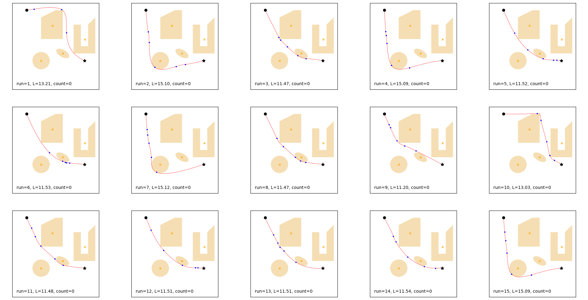
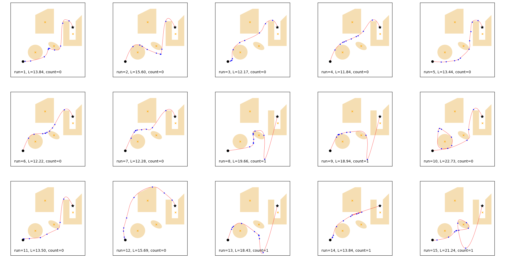
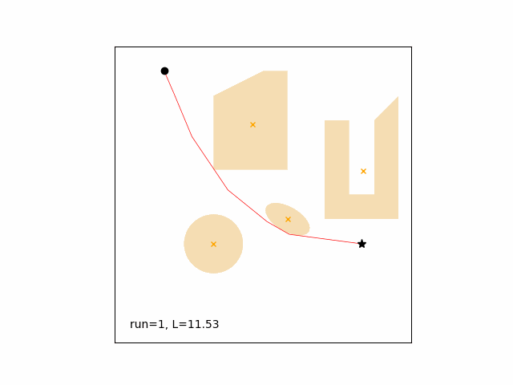

# Path Planning Using Particle Swarm Optimization

Implementation of particle swarm optimization (PSO) for path planning when the environment is known.

## Features

- The code has been written and tested in Python 3.8.5.

- Four types of obstacles: circle, ellipse, convex polygon, generic polygon.

- Start position, goal position, and obstacles can be dynamically changed to simulate motion.

- Penalty function of type `1/x` with the center in the obstacle centroid*.

- To improve the execution speed, the algorithms to determine if a point is inside an obstacle have been designed to carry out the determination on all points simultaneously.

- Points on the obstacle borders/edges are not considered inside the obstacle.

- Option to run sequential tests with different initial conditions to increase the chances to find a global minimum.

- Usage: *python test.py example*.

*Some centroid may be outside the obstacle, such as the U-shaped element in the below examples. If that is a problem the simples solution is to divide the obstacle in smaller shapes using convex polygons. For instance, for the mentioned U-shape obstacle two vertical and one horizontal polygons could be used.
     
## Main Parameters

`example` Number of the example to run (1, 2, or 3.)

`start` Start coordinates.

`goal` Goal coordinates.

`limits` Lower and upper boundaries of the map and search space in the PSO.

`nRun` Number of runs.

`nPts` Number of internal points defining the spline. The number of variables is twice this number.

`d` Number of segments between the spline breakpoints.

`nPop`, `epochs` Number of agents (population) and number of iterations.

`f_interp` Order of the spline (1st, 2nd and 3rd order, respectively.)

`Xinit` Initial value of the variables. Set `Xinit=None` to pick them randomly. This array is organized with first the x-coordinates of all internal points and then the y-coordinates of all internal points.

`K` Average size of each agent's group of informants. If `K=0` the entire swarm is used as agent's group of informants.

`phi` Coefficient to calculate the self-confidence coefficient and the confidence-in-others coefficient.

`vel_fact` Velocity factor to calculate the maximum and the minimum allowed velocities.

`conf_type` Confinement type (on the velocities): `HY=hyperbolic`, `RB=random-back`, `MX=mixed hyeperbolic/random-back`.

`IntVar` List of indexes specifying which variable should be treated as integer. If all variables are real set `IntVar=None`, if all variables are integer set `IntVar=all`.

`normalize` Specifies if the search space should be normalized (to improve convergency).

`rad` Normalized radius of the hypersphere centered on the best particle. The higher the number of other particles inside and the better is the solution.

## Examples

There are three examples, all of them using the same obstacles:

**Example 1**

- Multiple runs, cubic spline, optimizer initialized randomly.

- Best: run=9, L=11.20, count=0.

- No obstacle violations.

- See the code for the parameters used.

**Example 2**

- Multiple runs, quadratic spline, optimizer initialized with the straight line between start and goal position.

- Best: run=4, L=11.884, count=0.

- Obstacle violation in run 8, 9, 13, 14, and 15.

- See the code for the parameters used.

**Example 3**

- Single run, linear spline, optimizer initialized with the previous solution, start point chasing a moving goal with one obstacle (the circle) also moving.

- Path length goes from 11.53 (run 1) to 4.52 (run 65).

- No obstacle violations.

- See the code for the parameters used.

## References

- [PSO code](https://github.com/gabrielegilardi/PSO.git).

- [Centroid calculation](http://en.wikipedia.org/wiki/Centroid).

- [Points inside polygons](http://paulbourke.net/geometry/polygonmesh/).
